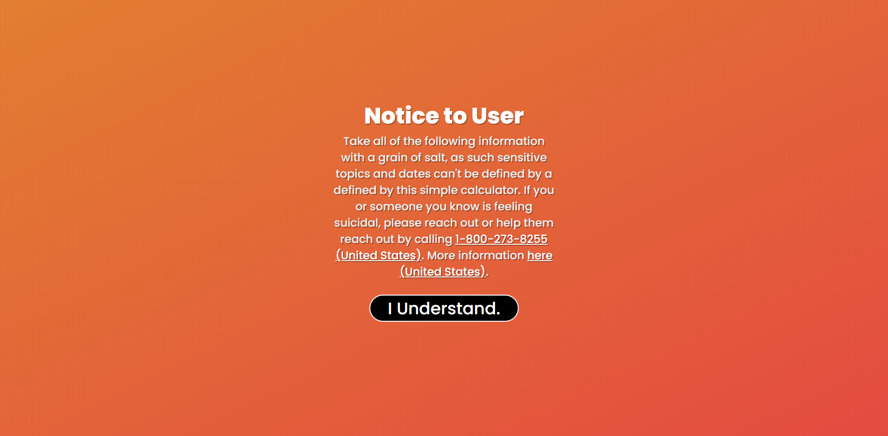
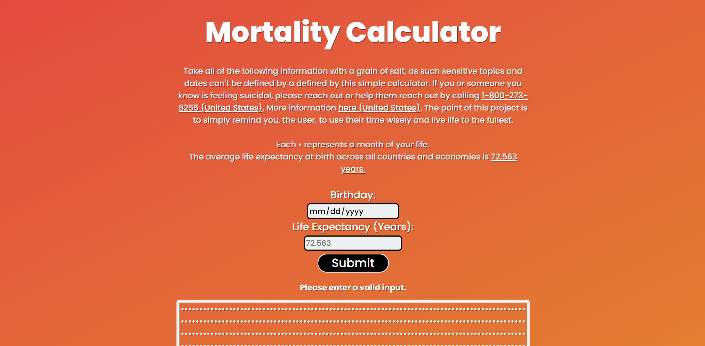
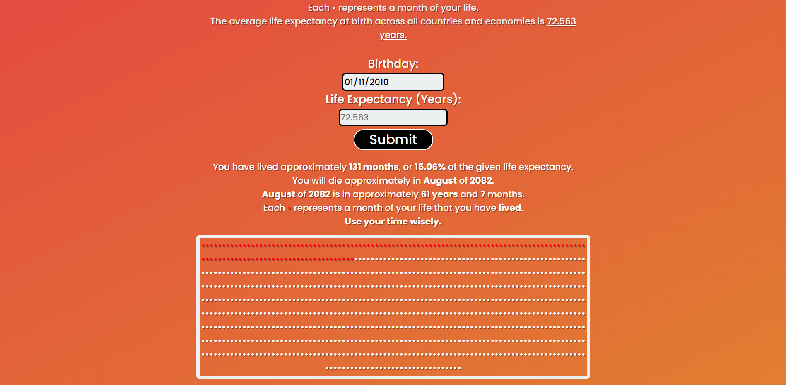

# Mortality Calculator

Projects's Purpose: To remind the user to use their time wisely and live life to the fullest.

This project was bootstrapped with [Create React App](https://github.com/facebook/create-react-app).

> Notice Screen
> 
> Main Screen
> 
> Calculations Output
> 

[Desktop Download (Version 0.1.0, No Back-End)](https://drive.google.com/file/d/1eWSqFzDl8VE3OrWXiO_5hiYNrhmpqsvM/view?usp=sharing)

To run locally (in browser):

- First replace the the url in "mongodbURL.js" to your own if you want to run the back-end.

> Install Dependancies

```
npm install
```

> Run

```
node server
npm start
```

This project may be further updated.

- Vamiq Valji
