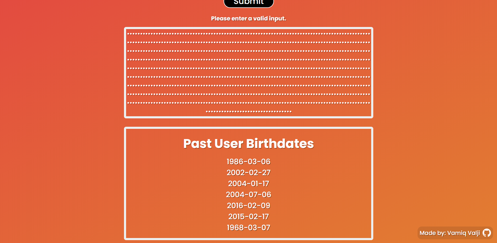

# Mortality Calculator

Projects's Purpose: To remind the user to use their time wisely and live life to the fullest.

This project was created using the MERN stack.

## Screenshots

> Notice Screen
> 
> Main Screen
> 
> Calculations Output
> 
> Displaying Past Users Data (Connected to a Back-End Database)
> 

## Usage

[Desktop Download (Version 0.1.0, No Back-End)](https://drive.google.com/file/d/1eWSqFzDl8VE3OrWXiO_5hiYNrhmpqsvM/view?usp=sharing)

### To run locally (in browser):

First replace the url in "mongodbURL.js" to your own database link if you want to run the back-end of the application.

> Install Dependancies

```
npm install
```

> Run

```
node server
npm start
```

This project may be further updated.

Version: 1.0

- Vamiq Valji
